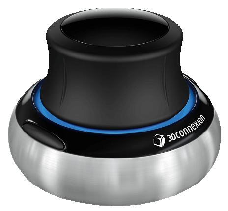

# spacenav



**3d mouse support**

spacenav 3d mouse jog support

Keywords: jog usb

## Pins:
*FPGA-pins*


## Options:
*user-options*
### name:
name of this plugin instance

 * type: str
 * default: 

### jointjog:

 * type: bool
 * default: False

### botton-0:

 * type: str
 * default: halui.spindle.0.start

### botton-1:

 * type: str
 * default: halui.spindle.0.stop

### x-scale:

 * type: float
 * default: -0.2

### y-scale:

 * type: float
 * default: -0.2

### z-scale:

 * type: float
 * default: 0.2

### a-scale:

 * type: float
 * default: 0.02

### b-scale:

 * type: float
 * default: 0.02

### c-scale:

 * type: float
 * default: 0.02


## Signals:
*signals/pins in LinuxCNC*


## Interfaces:
*transport layer*


## Basic-Example:
```
{
    "type": "spacenav",
    "pins": {}
}
```

## Full-Example:
```
{
    "type": "spacenav",
    "name": "",
    "jointjog": false,
    "botton-0": "halui.spindle.0.start",
    "botton-1": "halui.spindle.0.stop",
    "x-scale": -0.2,
    "y-scale": -0.2,
    "z-scale": 0.2,
    "a-scale": 0.02,
    "b-scale": 0.02,
    "c-scale": 0.02,
    "pins": {},
    "signals": {}
}
```
