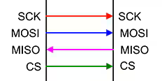

# spi

**spi interface for host comunication**

for direct connections via SPI

* Keywords: interface spi raspberry rpi
* NEEDS: fpga
* PROVIDES: spi, interface

## Pins:
*FPGA-pins*
### mosi:

 * direction: input

### miso:

 * direction: output

### sclk:

 * direction: input

### sel:

 * direction: input

## Options:
*user-options*
### name:
name of this plugin instance

 * type: str
 * default: 

### spitype:
SPI-Type

 * type: select
 * default: rpi4
 * options: rpi4, rpi5, generic

### cs:
Chip-Select pin on the Host-Side CS0/CS1

 * type: int
 * min: 0
 * max: 1
 * default: 0

### frame:
frame size

 * type: select
 * default: full
 * options: full, no_timestamp, no_header, minimum

## Signals:
*signals/pins in LinuxCNC*

## Interfaces:
*transport layer*

## Verilogs:
 * [spi.v](spi.v)
