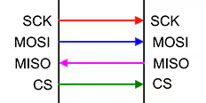

# spi_prog



**spi interface for host comunication and flash programming**

for direct connections to Raspberry-PI - supporting flash programming

Keywords: interface spi raspberry rpi flash mesa

## Pins:
*FPGA-pins*
### mosi:

 * direction: input

### miso:

 * direction: output

### sclk:

 * direction: input

### sel:

 * direction: input

### prog:

 * direction: input
 * pull: down

### reboot:

 * direction: output
 * pull: down

### eeprom_mosi:

 * direction: output

### eeprom_miso:

 * direction: input

### eeprom_sclk:

 * direction: output

### eeprom_sel:

 * direction: output


## Options:
*user-options*
### name:
name of this plugin instance

 * type: str
 * default: 


## Signals:
*signals/pins in LinuxCNC*


## Interfaces:
*transport layer*


## Basic-Example:
```
{
    "type": "spi_prog",
    "pins": {
        "mosi": {
            "pin": "0"
        },
        "miso": {
            "pin": "1"
        },
        "sclk": {
            "pin": "2"
        },
        "sel": {
            "pin": "3"
        },
        "prog": {
            "pin": "4"
        },
        "reboot": {
            "pin": "5"
        },
        "eeprom_mosi": {
            "pin": "6"
        },
        "eeprom_miso": {
            "pin": "7"
        },
        "eeprom_sclk": {
            "pin": "8"
        },
        "eeprom_sel": {
            "pin": "9"
        }
    }
}
```

## Full-Example:
```
{
    "type": "spi_prog",
    "name": "",
    "pins": {
        "mosi": {
            "pin": "0",
            "modifiers": [
                {
                    "type": "debounce"
                }
            ]
        },
        "miso": {
            "pin": "1",
            "modifiers": [
                {
                    "type": "invert"
                }
            ]
        },
        "sclk": {
            "pin": "2",
            "modifiers": [
                {
                    "type": "debounce"
                },
                {
                    "type": "invert"
                }
            ]
        },
        "sel": {
            "pin": "3",
            "modifiers": [
                {
                    "type": "debounce"
                },
                {
                    "type": "invert"
                }
            ]
        },
        "prog": {
            "pin": "4",
            "modifiers": [
                {
                    "type": "debounce"
                },
                {
                    "type": "invert"
                }
            ]
        },
        "reboot": {
            "pin": "5",
            "modifiers": [
                {
                    "type": "invert"
                }
            ]
        },
        "eeprom_mosi": {
            "pin": "6",
            "modifiers": [
                {
                    "type": "invert"
                }
            ]
        },
        "eeprom_miso": {
            "pin": "7",
            "modifiers": [
                {
                    "type": "debounce"
                },
                {
                    "type": "invert"
                }
            ]
        },
        "eeprom_sclk": {
            "pin": "8",
            "modifiers": [
                {
                    "type": "invert"
                }
            ]
        },
        "eeprom_sel": {
            "pin": "9",
            "modifiers": [
                {
                    "type": "invert"
                }
            ]
        }
    },
    "signals": {}
}
```

## Verilogs:
 * [spi_prog.v](spi_prog.v)
