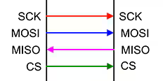

# spibridge

**spi interface for host comunication over UDB2SPI-Bridges**

for UDP connections via UDB2SPI-Bridges

* Keywords: interface spi raspberry rpi
* NEEDS: fpga
* PROVIDES: spi, interface

## Pins:
*FPGA-pins*
### mosi:

 * direction: input

### miso:

 * direction: output

### sclk:

 * direction: input

### sel:

 * direction: input

## Options:
*user-options*
### name:
name of this plugin instance

 * type: str
 * default: 

### ip:
IP-Address

 * type: str
 * default: 192.168.10.194

### mask:
Network-Mask

 * type: str
 * default: 255.255.255.0

### gw:
Gateway IP-Address

 * type: str
 * default: 192.168.10.1

### port:
UDP-Port

 * type: int
 * default: 2390

## Signals:
*signals/pins in LinuxCNC*

## Interfaces:
*transport layer*

## Verilogs:
 * [spi.v](spi.v)
