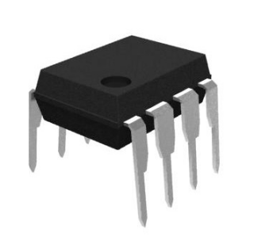

# spipoti

**spi digital poti**

Analog-Output via spi digital poti

* Keywords: analog poti dac
* NEEDS: fpga

## Pins:
*FPGA-pins*
### mosi:

 * direction: output

### sclk:

 * direction: output

### sel:

 * direction: output

## Options:
*user-options*
### name:
name of this plugin instance

 * type: str
 * default: 

### image:
hardware type

 * type: imgselect
 * default: generic

## Signals:
*signals/pins in LinuxCNC*
### value:

 * type: float
 * direction: output

## Interfaces:
*transport layer*
### value:

 * size: 8 bit
 * direction: output

## Verilogs:
 * [spipoti.v](spipoti.v)
