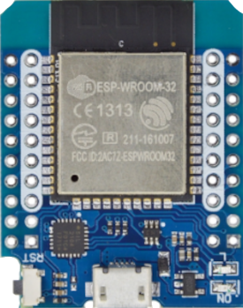

# sserial



**support for custom mesa-sserial devices**

Keywords: smart-serial rgb wled rs422

## Pins:
*FPGA-pins*
### SSERIAL:RX:

 * direction: all

### SSERIAL:TX:

 * direction: all

### IO:36:

 * direction: all

### IO:39:

 * direction: all

### IO:34:

 * direction: all

### IO:35:

 * direction: all

### IO:32:

 * direction: all

### IO:33:

 * direction: all

### IO:25:

 * direction: all

### IO:26:

 * direction: all

### IO:27:

 * direction: all

### IO:14:

 * direction: all

### IO:12:

 * direction: all

### IO:13:

 * direction: all

### IO:23:

 * direction: all

### IO:22:

 * direction: all

### IO:21:

 * direction: all

### IO:19:

 * direction: all

### IO:18:

 * direction: all

### IO:5:

 * direction: all

### IO:4:

 * direction: all

### IO:2:

 * direction: all

### IO:15:

 * direction: all


## Options:
*user-options*
### name:
name of this plugin instance

 * type: str
 * default: 

### node_type:
instance type

 * type: select
 * default: sserial

### board:
board type

 * type: select
 * default: esp32dev

### cardname:
card name

 * type: select
 * default: 9r01

### upload_port:
upload-port

 * type: str
 * default: /dev/ttyUSB0


## Signals:
*signals/pins in LinuxCNC*


## Interfaces:
*transport layer*


## Basic-Example:
```
{
    "type": "sserial",
    "pins": {
        "SSERIAL:RX": {
            "pin": "0"
        },
        "SSERIAL:TX": {
            "pin": "1"
        },
        "IO:36": {
            "pin": "2"
        },
        "IO:39": {
            "pin": "3"
        },
        "IO:34": {
            "pin": "4"
        },
        "IO:35": {
            "pin": "5"
        },
        "IO:32": {
            "pin": "6"
        },
        "IO:33": {
            "pin": "7"
        },
        "IO:25": {
            "pin": "8"
        },
        "IO:26": {
            "pin": "9"
        },
        "IO:27": {
            "pin": "10"
        },
        "IO:14": {
            "pin": "11"
        },
        "IO:12": {
            "pin": "12"
        },
        "IO:13": {
            "pin": "13"
        },
        "IO:23": {
            "pin": "14"
        },
        "IO:22": {
            "pin": "15"
        },
        "IO:21": {
            "pin": "16"
        },
        "IO:19": {
            "pin": "17"
        },
        "IO:18": {
            "pin": "18"
        },
        "IO:5": {
            "pin": "19"
        },
        "IO:4": {
            "pin": "20"
        },
        "IO:2": {
            "pin": "21"
        },
        "IO:15": {
            "pin": "22"
        }
    }
}
```

## Full-Example:
```
{
    "type": "sserial",
    "name": "",
    "node_type": "sserial",
    "board": "esp32dev",
    "cardname": "9r01",
    "upload_port": "/dev/ttyUSB0",
    "pins": {
        "SSERIAL:RX": {
            "pin": "0",
            "modifiers": [
                {
                    "type": "invert"
                }
            ]
        },
        "SSERIAL:TX": {
            "pin": "1",
            "modifiers": [
                {
                    "type": "invert"
                }
            ]
        },
        "IO:36": {
            "pin": "2",
            "modifiers": [
                {
                    "type": "invert"
                }
            ]
        },
        "IO:39": {
            "pin": "3",
            "modifiers": [
                {
                    "type": "invert"
                }
            ]
        },
        "IO:34": {
            "pin": "4",
            "modifiers": [
                {
                    "type": "invert"
                }
            ]
        },
        "IO:35": {
            "pin": "5",
            "modifiers": [
                {
                    "type": "invert"
                }
            ]
        },
        "IO:32": {
            "pin": "6",
            "modifiers": [
                {
                    "type": "invert"
                }
            ]
        },
        "IO:33": {
            "pin": "7",
            "modifiers": [
                {
                    "type": "invert"
                }
            ]
        },
        "IO:25": {
            "pin": "8",
            "modifiers": [
                {
                    "type": "invert"
                }
            ]
        },
        "IO:26": {
            "pin": "9",
            "modifiers": [
                {
                    "type": "invert"
                }
            ]
        },
        "IO:27": {
            "pin": "10",
            "modifiers": [
                {
                    "type": "invert"
                }
            ]
        },
        "IO:14": {
            "pin": "11",
            "modifiers": [
                {
                    "type": "invert"
                }
            ]
        },
        "IO:12": {
            "pin": "12",
            "modifiers": [
                {
                    "type": "invert"
                }
            ]
        },
        "IO:13": {
            "pin": "13",
            "modifiers": [
                {
                    "type": "invert"
                }
            ]
        },
        "IO:23": {
            "pin": "14",
            "modifiers": [
                {
                    "type": "invert"
                }
            ]
        },
        "IO:22": {
            "pin": "15",
            "modifiers": [
                {
                    "type": "invert"
                }
            ]
        },
        "IO:21": {
            "pin": "16",
            "modifiers": [
                {
                    "type": "invert"
                }
            ]
        },
        "IO:19": {
            "pin": "17",
            "modifiers": [
                {
                    "type": "invert"
                }
            ]
        },
        "IO:18": {
            "pin": "18",
            "modifiers": [
                {
                    "type": "invert"
                }
            ]
        },
        "IO:5": {
            "pin": "19",
            "modifiers": [
                {
                    "type": "invert"
                }
            ]
        },
        "IO:4": {
            "pin": "20",
            "modifiers": [
                {
                    "type": "invert"
                }
            ]
        },
        "IO:2": {
            "pin": "21",
            "modifiers": [
                {
                    "type": "invert"
                }
            ]
        },
        "IO:15": {
            "pin": "22",
            "modifiers": [
                {
                    "type": "invert"
                }
            ]
        }
    },
    "signals": {}
}
```
