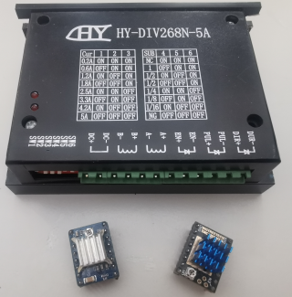

# stepdir

**step/dir output for stepper drivers**

to control motor drivers via step/dir pin's and an optional enable pin

* Keywords: stepper servo joint
* NEEDS: fpga

## Pins:
*FPGA-pins*
### step:

 * direction: output

### dir:

 * direction: output

### en:

 * direction: output
 * optional: True

## Options:
*user-options*
### name:
name of this plugin instance

 * type: str
 * default: 

### is_joint:
configure as joint

 * type: bool
 * default: True

### axis:
axis name (X,Y,Z,...)

 * type: select
 * default: None
 * options: X, Y, Z, A, B, C, U, V, W

### image:
hardware type

 * type: imgselect
 * default: generic

### pulse_len:
step pulse len

 * type: float
 * min: 0.0
 * max: 1000.0
 * default: 4.0
 * unit: us

### dir_delay:
delay after dir change

 * type: float
 * min: 0.1
 * max: 1000.0
 * default: 0.7
 * unit: us

## Signals:
*signals/pins in LinuxCNC*
### velocity:
speed in steps per second

 * type: float
 * direction: output
 * min: -100000
 * max: 100000
 * unit: Hz

### position:
position feedback

 * type: float
 * direction: input
 * unit: steps

### enable:

 * type: bit
 * direction: output

## Interfaces:
*transport layer*
### velocity:

 * size: 32 bit
 * direction: output

### enable:

 * size: 1 bit
 * direction: output

### position:

 * size: 32 bit
 * direction: input

## Verilogs:
 * [stepdir.v](stepdir.v)
