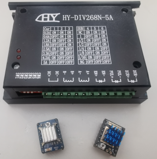

# stepgen

**software step pulse generation**

stepgen is used to control stepper motors.
The maximum step rate depends on the CPU and other factors,
and is usually in the range of 5 kHz to 25 kHz.
If higher rates are needed, a hardware step generator is a better choice.

* Keywords: stepper
* NEEDS: gpio, basethread

## Pins:
*FPGA-pins*
### step:

 * direction: output

### dir:

 * direction: output

## Options:
*user-options*
### name:
name of this plugin instance

 * type: str
 * default: 

### is_joint:
configure as joint

 * type: bool
 * default: True

### axis:
axis name (X,Y,Z,...)

 * type: select
 * default: None
 * options: X, Y, Z, A, B, C, U, V, W

### image:
hardware type

 * type: imgselect
 * default: generic

### mode:
Modus

 * type: select
 * default: 0
 * options: 0|step/dir, 1|up/down, 2|quadrature, 3|three phase, full step, 4|three phase, half step, 5|four phase, full step (unipolar), 6|four phase, full step (unipolar), 7|four phase, full step (bipolar), 8|four phase, full step (bipolar), 9|four phase, half step (unipolar), 10|four phase, half step (bipolar), 11|five phase, full step, 12|five phase, full step, 13|five phase, half step, 14|five phase, half step, 15|user-specified

## Signals:
*signals/pins in LinuxCNC*
### position-cmd:
set position

 * type: float
 * direction: output

### position-fb:
position feedback

 * type: float
 * direction: input
 * unit: steps

### position-scale:
steps / unit

 * type: float
 * direction: output

## Interfaces:
*transport layer*

