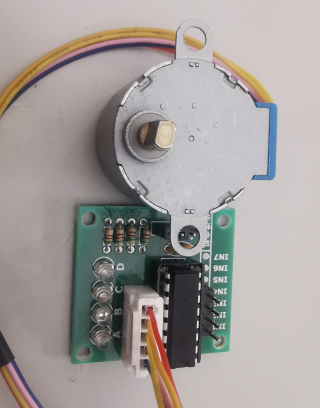

# stepper

**stepper driver output for H-Bridges like L298**

direct stepper driver with 4pin's directly controlled by the FPGA

* Keywords: stepper joint hbridge
* NEEDS: fpga

## Pins:
*FPGA-pins*
### a1:

 * direction: output

### a2:

 * direction: output

### b1:

 * direction: output

### b2:

 * direction: output

## Options:
*user-options*
### name:
name of this plugin instance

 * type: str
 * default: 

### is_joint:
configure as joint

 * type: bool
 * default: True

### axis:
axis name (X,Y,Z,...)

 * type: select
 * default: None
 * options: X, Y, Z, A, B, C, U, V, W

### image:
hardware type

 * type: imgselect
 * default: generic

## Signals:
*signals/pins in LinuxCNC*
### velocity:
speed in steps per second

 * type: float
 * direction: output
 * min: -1000000
 * max: 1000000
 * unit: Hz

### position:
position feedback

 * type: float
 * direction: input
 * unit: Steps

### enable:

 * type: bit
 * direction: output

## Interfaces:
*transport layer*
### velocity:

 * size: 32 bit
 * direction: output

### position:

 * size: 32 bit
 * direction: input

### enable:

 * size: 1 bit
 * direction: output

## Verilogs:
 * [stepper.v](stepper.v)
