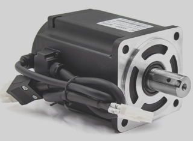

# t3d_abs




| :warning: EXPERIMENTAL |
|:-----------------------|

**serial abs-encoder hltnc t3d**

abs-encoder over rs485

17bit Absolute

Firewire-Connector:
* 1 PS+
* 2 PS-
* 3 NC
* 4 NC
* 5 5V
* 6 GND

Keywords: absolute angle bldc hltnc_t3d A6

## Pins:
*FPGA-pins*
### rx:

 * direction: input

### tx:

 * direction: output

### tx_enable:

 * direction: output

### debug_bit:

 * direction: output
 * optional: True


## Options:
*user-options*
### delay:
clock delay for next manchester bit

 * type: int
 * min: 1
 * max: 100
 * default: 3
 * unit: clocks

### delay_next:
clock delay for center of the next manchester bit

 * type: int
 * min: 1
 * max: 100
 * default: 4
 * unit: clocks

### name:
name of this plugin instance

 * type: str
 * default: 


## Signals:
*signals/pins in LinuxCNC*
### angle:

 * type: float
 * direction: input

### position:

 * type: float
 * direction: input

### csum:

 * type: float
 * direction: input


## Interfaces:
*transport layer*
### angle:

 * size: 16 bit
 * direction: input

### position:

 * size: 32 bit
 * direction: input

### csum:

 * size: 8 bit
 * direction: input


## Basic-Example:
```
{
    "type": "t3d_abs",
    "pins": {
        "rx": {
            "pin": "0"
        },
        "tx": {
            "pin": "1"
        },
        "tx_enable": {
            "pin": "2"
        },
        "debug_bit": {
            "pin": "3"
        }
    }
}
```

## Full-Example:
```
{
    "type": "t3d_abs",
    "delay": 3,
    "delay_next": 4,
    "name": "",
    "pins": {
        "rx": {
            "pin": "0",
            "modifiers": [
                {
                    "type": "debounce"
                }
            ]
        },
        "tx": {
            "pin": "1",
            "modifiers": [
                {
                    "type": "invert"
                }
            ]
        },
        "tx_enable": {
            "pin": "2",
            "modifiers": [
                {
                    "type": "invert"
                }
            ]
        },
        "debug_bit": {
            "pin": "3",
            "modifiers": [
                {
                    "type": "invert"
                }
            ]
        }
    },
    "signals": {
        "angle": {
            "net": "xxx.yyy.zzz",
            "function": "rio.xxx",
            "scale": 100.0,
            "offset": 0.0,
            "display": {
                "title": "angle",
                "section": "inputs",
                "type": "meter"
            }
        },
        "position": {
            "net": "xxx.yyy.zzz",
            "function": "rio.xxx",
            "scale": 100.0,
            "offset": 0.0,
            "display": {
                "title": "position",
                "section": "inputs",
                "type": "meter"
            }
        },
        "csum": {
            "net": "xxx.yyy.zzz",
            "function": "rio.xxx",
            "scale": 100.0,
            "offset": 0.0,
            "display": {
                "title": "csum",
                "section": "inputs",
                "type": "meter"
            }
        }
    }
}
```

## Verilogs:
 * [t3d_abs.v](t3d_abs.v)
 * [uart_baud.v](uart_baud.v)
 * [uart_rx.v](uart_rx.v)
 * [uart_tx.v](uart_tx.v)
