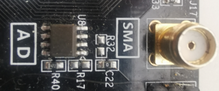

# tlc549c

**spi adc input**

Analog input via tlc549 ADC

* Keywords: analog adc
* NEEDS: fpga

## Pins:
*FPGA-pins*
### miso:

 * direction: input

### sclk:

 * direction: output

### sel:

 * direction: output

## Options:
*user-options*
### name:
name of this plugin instance

 * type: str
 * default: 

### image:
hardware type

 * type: imgselect
 * default: generic

## Signals:
*signals/pins in LinuxCNC*
### value:
measured voltage

 * type: float
 * direction: input
 * unit: Volt

## Interfaces:
*transport layer*
### value:

 * size: 8 bit
 * direction: input

## Verilogs:
 * [tlc549c.v](tlc549c.v)
