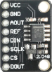

# tlc5615



**spi dac**

Analog-Output via spi dac

Keywords: analog dac

## Pins:
*FPGA-pins*
### mosi:

 * direction: output

### sclk:

 * direction: output

### sel:

 * direction: output


## Options:
*user-options*
### name:
name of this plugin instance

 * type: str
 * default: 


## Signals:
*signals/pins in LinuxCNC*
### value:

 * type: float
 * direction: output
 * min: 0
 * max: 1023


## Interfaces:
*transport layer*
### value:

 * size: 16 bit
 * direction: output


## Basic-Example:
```
{
    "type": "tlc5615",
    "pins": {
        "mosi": {
            "pin": "0"
        },
        "sclk": {
            "pin": "1"
        },
        "sel": {
            "pin": "2"
        }
    }
}
```

## Full-Example:
```
{
    "type": "tlc5615",
    "name": "",
    "pins": {
        "mosi": {
            "pin": "0",
            "modifiers": [
                {
                    "type": "invert"
                }
            ]
        },
        "sclk": {
            "pin": "1",
            "modifiers": [
                {
                    "type": "invert"
                }
            ]
        },
        "sel": {
            "pin": "2",
            "modifiers": [
                {
                    "type": "invert"
                }
            ]
        }
    },
    "signals": {
        "value": {
            "net": "xxx.yyy.zzz",
            "function": "rio.xxx",
            "scale": 100.0,
            "offset": 0.0,
            "display": {
                "title": "value",
                "section": "outputs",
                "type": "scale"
            }
        }
    }
}
```

## Verilogs:
 * [tlc5615.v](tlc5615.v)
