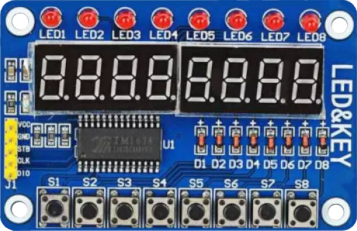

# tm1638b8s7l8

**7segment display with buttons**

with this plugin, you can use cheap TM1638 boards with LED's/Switches and 7segment displays as control interface for LinuxCNC (JOG/DRO) / works with 3.3V

* Keywords: display info status keyboard buttons
* NEEDS: fpga

## Pins:
*FPGA-pins*
### sel:
Select-Pin (STB)

 * direction: output

### sclk:
Clock-Pin (CLK)

 * direction: output

### data:
Data-Pin (DIO)

 * direction: inout

## Options:
*user-options*
### name:
name of this plugin instance

 * type: str
 * default: 

### speed:
Data-clock

 * type: int
 * default: 1000000

## Signals:
*signals/pins in LinuxCNC*
### sw0:

 * type: bit
 * direction: input

### sw1:

 * type: bit
 * direction: input

### sw2:

 * type: bit
 * direction: input

### sw3:

 * type: bit
 * direction: input

### sw4:

 * type: bit
 * direction: input

### sw5:

 * type: bit
 * direction: input

### sw6:

 * type: bit
 * direction: input

### sw7:

 * type: bit
 * direction: input

### led0:

 * type: bit
 * direction: output

### led1:

 * type: bit
 * direction: output

### led2:

 * type: bit
 * direction: output

### led3:

 * type: bit
 * direction: output

### led4:

 * type: bit
 * direction: output

### led5:

 * type: bit
 * direction: output

### led6:

 * type: bit
 * direction: output

### led7:

 * type: bit
 * direction: output

### number1:
last 6 digits (-6500.0 -> 6500.0)

 * type: float
 * direction: output
 * min: -6500.0
 * max: 6500.0

### number2:
first 2 digits (0 -> 99)

 * type: float
 * direction: output
 * min: 0
 * max: 99

## Interfaces:
*transport layer*
### sw0:

 * size: 1 bit
 * direction: input
 * multiplexed: True

### sw1:

 * size: 1 bit
 * direction: input
 * multiplexed: True

### sw2:

 * size: 1 bit
 * direction: input
 * multiplexed: True

### sw3:

 * size: 1 bit
 * direction: input
 * multiplexed: True

### sw4:

 * size: 1 bit
 * direction: input
 * multiplexed: True

### sw5:

 * size: 1 bit
 * direction: input
 * multiplexed: True

### sw6:

 * size: 1 bit
 * direction: input
 * multiplexed: True

### sw7:

 * size: 1 bit
 * direction: input
 * multiplexed: True

### led0:

 * size: 1 bit
 * direction: output
 * multiplexed: True

### led1:

 * size: 1 bit
 * direction: output
 * multiplexed: True

### led2:

 * size: 1 bit
 * direction: output
 * multiplexed: True

### led3:

 * size: 1 bit
 * direction: output
 * multiplexed: True

### led4:

 * size: 1 bit
 * direction: output
 * multiplexed: True

### led5:

 * size: 1 bit
 * direction: output
 * multiplexed: True

### led6:

 * size: 1 bit
 * direction: output
 * multiplexed: True

### led7:

 * size: 1 bit
 * direction: output
 * multiplexed: True

### number1:

 * size: 32 bit
 * direction: output
 * multiplexed: True

### number2:

 * size: 8 bit
 * direction: output
 * multiplexed: True

## Verilogs:
 * [tm1638b8s7l8.v](tm1638b8s7l8.v)
