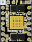

# tmc5160

| :warning: EXPERIMENTAL |
|:-----------------------|

**TMC5160 SPI joint**

Joint controlled through the TMC5160 internal ramp generator.
Velocity is written through SPI and XACTUAL is used as position feedback.

WARNING: if you use a board like the TMC5160T Pro V1.0,
you need to modify it to disable SD-Mode
This drivers have enabled SPI, but only for configuration.

* Keywords: joint stepper tmc5160 spi trinamic

## Pins:
*FPGA-pins*
### sck:
TMC5160 SPI clock, mode 3

 * direction: output

### mosi:
TMC5160 SPI data input

 * direction: output

### miso:
TMC5160 SPI data output

 * direction: input

### cs_n:
TMC5160 active-low chip select

 * direction: output

### enable_n:
TMC5160 active-low driver enable

 * direction: output

## Options:
*user-options*
### name:
name of this plugin instance

 * type: str
 * default: 

### is_joint:
configure as joint

 * type: bool
 * default: True

### axis:
axis name (X,Y,Z,...)

 * type: select
 * default: None
 * options: X, Y, Z, A, B, C, U, V, W

### image:
hardware type

 * type: imgselect
 * default: generic

### microsteps:
MRES

 * type: select
 * default: 256
 * options: 256, 128, 64, 32, 16, 8, 4, 2, FULL

### rsense:
current sense resistor in Ohm

 * type: float
 * min: 0.01
 * max: 0.5
 * default: 0.075

### global_scaler:
Global scaling of Motor current - Hint: Values >128 recommended for best results

 * type: int
 * min: 32
 * max: 256
 * default: 130

### irun:

 * type: int
 * min: 0
 * max: 31
 * default: 16

### ihold:

 * type: int
 * min: 0
 * max: 31
 * default: 5

### ihold_delay:

 * type: int
 * min: 0
 * max: 15
 * default: 4

### debug:
add debug signals

 * type: bool
 * default: False

## Signals:
*signals/pins in LinuxCNC*
### velocity:
speed in steps per second

 * type: float
 * direction: output
 * min: -100000
 * max: 100000
 * unit: Hz

### enable:
Joint amplifier enable

 * type: bit
 * direction: output

### position:
XACTUAL position / Feedback

 * type: float
 * direction: input
 * unit: unit

### fault:
TMC5160 driver error or short/overtemperature

 * type: bit
 * direction: input

## Interfaces:
*transport layer*
### velocity:

 * size: 32 bit
 * direction: output

### enable:

 * size: 1 bit
 * direction: output

### position:

 * size: 32 bit
 * direction: input

### fault:

 * size: 1 bit
 * direction: input

## Verilogs:
 * [tmc5160.v](tmc5160.v)
