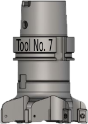

# tooltracker

**simple tool time tracker**

simple tool time tracker

* Keywords: tool time tracker

## Pins:
*FPGA-pins*

## Options:
*user-options*
### name:
name of this plugin instance

 * type: str
 * default: 

### image:
hardware type

 * type: imgselect
 * default: generic

### debug:

 * type: bool
 * default: False

### display:

 * type: select
 * default: bar
 * options: off, bar, meter

## Signals:
*signals/pins in LinuxCNC*

## Interfaces:
*transport layer*

