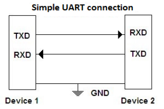

# uart

**uart interface for host cominucation**

simple uart interface, not usable for realtime stuff in LinuxCNC / only for testing

* Keywords: serial uart interface
* NEEDS: fpga

## Pins:
*FPGA-pins*
### rx:

 * direction: input

### tx:

 * direction: output

### tx_enable:

 * direction: output
 * optional: True

### SAT:

 * direction: output
 * optional: True

## Options:
*user-options*
### name:
name of this plugin instance

 * type: str
 * default: 

### baud:
serial baud rate

 * type: int
 * min: 9600
 * max: 10000000
 * default: 1000000
 * unit: bit/s

### uart:
serial device (if connected to host)

 * type: str
 * default: /dev/ttyUSB0

### csum:
activate checksums

 * type: bool
 * default: True

### async:
async

 * type: bool
 * default: False

### frame:
frame size

 * type: select
 * default: full
 * options: full, no_timestamp, no_header, minimum

### debug:
always response

 * type: bool
 * default: False

## Signals:
*signals/pins in LinuxCNC*

## Interfaces:
*transport layer*

## Verilogs:
 * [uart.v](uart.v)
 * [uart_baud.v](uart_baud.v)
 * [uart_rx.v](uart_rx.v)
 * [uart_tx.v](uart_tx.v)
