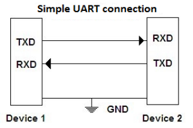

# uartbridge

| :warning: EXPERIMENTAL |
|:-----------------------|

**uart bridge - python only**

uart bridge to send and receive custom frames via uart port

* Keywords: serial uart
* NEEDS: fpga
* PROVIDES: uart, interface

## Pins:
*FPGA-pins*
### tx:

 * direction: output

### rx:

 * direction: input

### tx_enable:

 * direction: output
 * optional: True

## Options:
*user-options*
### name:
name of this plugin instance

 * type: str
 * default: 

### baud:
serial baud rate

 * type: int
 * min: 300
 * max: 10000000
 * default: 9600
 * unit: bit/s

### rx_buffersize:
max rx buffer size

 * type: int
 * min: 32
 * max: 255
 * default: 40
 * unit: bits

### tx_buffersize:
max tx buffer size

 * type: int
 * min: 32
 * max: 255
 * default: 32
 * unit: bits

### tx_frame:
tx frame format

 * type: str
 * default: tx1:u8|tx2:u8

### rx_frame:
rx frame format

 * type: str
 * default: rx1:u8|rx2:u8

## Signals:
*signals/pins in LinuxCNC*
### tx1:

 * type: float
 * direction: output
 * min: 0
 * max: 255

### tx2:

 * type: float
 * direction: output
 * min: 0
 * max: 255

### rx1:

 * type: float
 * direction: input

### rx2:

 * type: float
 * direction: input

## Interfaces:
*transport layer*
### rxdata:

 * size: 40 bit
 * direction: input

### txdata:

 * size: 32 bit
 * direction: output

## Verilogs:
 * [uartbridge.v](uartbridge.v)
 * [uart_baud.v](uart_baud.v)
 * [uart_rx.v](uart_rx.v)
 * [uart_tx.v](uart_tx.v)
