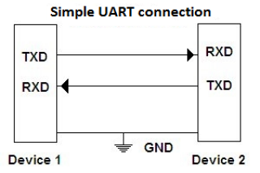

# uartsub



**uartsub interface for host cominucation**

simple uartsub interface, not usable for realtime stuff in LinuxCNC / only for testing

Keywords: serial uartsub interface

## Pins:
*FPGA-pins*
### rx:

 * direction: input

### tx:

 * direction: output

### tx_enable:

 * direction: output
 * optional: True

### SAT:OUT:

 * direction: output


## Options:
*user-options*
### name:
name of this plugin instance

 * type: str
 * default: 

### baud:
serial baud rate

 * type: int
 * min: 9600
 * max: 10000000
 * default: 2500000
 * unit: bit/s


## Signals:
*signals/pins in LinuxCNC*


## Interfaces:
*transport layer*


## Basic-Example:
```
{
    "type": "uartsub",
    "pins": {
        "rx": {
            "pin": "0"
        },
        "tx": {
            "pin": "1"
        },
        "tx_enable": {
            "pin": "2"
        },
        "SAT:OUT": {
            "pin": "3"
        }
    }
}
```

## Full-Example:
```
{
    "type": "uartsub",
    "name": "",
    "baud": 2500000,
    "pins": {
        "rx": {
            "pin": "0",
            "modifiers": [
                {
                    "type": "debounce"
                }
            ]
        },
        "tx": {
            "pin": "1",
            "modifiers": [
                {
                    "type": "invert"
                }
            ]
        },
        "tx_enable": {
            "pin": "2",
            "modifiers": [
                {
                    "type": "invert"
                }
            ]
        },
        "SAT:OUT": {
            "pin": "3",
            "modifiers": [
                {
                    "type": "invert"
                }
            ]
        }
    },
    "signals": {}
}
```

## Verilogs:
 * [uartsub.v](uartsub.v)
 * [uart_baud.v](uart_baud.v)
 * [uart_rx.v](uart_rx.v)
 * [uart_tx.v](uart_tx.v)
