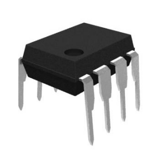

# udpoti

**digital-poti with up/down+dir interface**

controling digital poti for analog outputs

* Keywords: analog dac poti
* NEEDS: fpga

## Pins:
*FPGA-pins*
### updown:

 * direction: output

### increment:

 * direction: output

## Options:
*user-options*
### name:
name of this plugin instance

 * type: str
 * default: 

### image:
hardware type

 * type: imgselect
 * default: generic

### resolution:
number of steps from min to maximum value

 * type: int
 * min: 0
 * max: 255
 * default: 100

### frequency:
interface frequency

 * type: int
 * min: 0
 * max: 100000
 * default: 100
 * unit: Hz

## Signals:
*signals/pins in LinuxCNC*
### value:

 * type: float
 * direction: output

## Interfaces:
*transport layer*
### value:

 * size: 32 bit
 * direction: output

## Verilogs:
 * [udpoti.v](udpoti.v)
