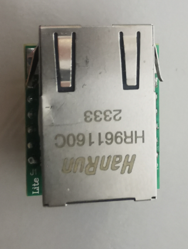

# w5500

**udp interface for host comunication**

w5500 driver for the interface communication over UDP

* Keywords: ethernet network udp interface
* NEEDS: fpga
* PROVIDES: udp, interface

## Pins:
*FPGA-pins*
### mosi:

 * direction: output

### miso:

 * direction: input

### sclk:

 * direction: output

### sel:

 * direction: output

### rst:

 * direction: output
 * optional: True

### intr:

 * direction: input
 * optional: True

## Options:
*user-options*
### name:
name of this plugin instance

 * type: str
 * default: 

### image:
hardware type

 * type: imgselect
 * default: generic

### mac:
MAC-Address

 * type: str
 * default: AA:AF:FA:CC:E3:1C

### ip:
IP-Address

 * type: str
 * default: 192.168.10.194

### mask:
Network-Mask

 * type: str
 * default: 255.255.255.0

### gw:
Gateway IP-Address

 * type: str
 * default: 192.168.10.1

### port:
UDP-Port

 * type: int
 * default: 2390

### speed:
SPI clock

 * type: int
 * default: 10000000

### async:
async

 * type: bool
 * default: False

### frame:
frame size

 * type: select
 * default: full
 * options: full, no_timestamp, no_header, minimum

## Signals:
*signals/pins in LinuxCNC*

## Interfaces:
*transport layer*

## Verilogs:
 * [w5500.v](w5500.v)
