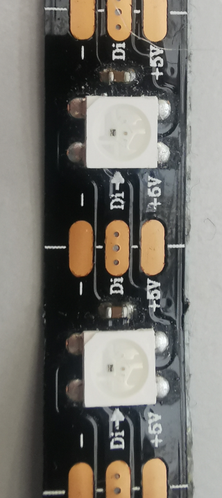

# wled

**ws2812b interface**

simple ws2812b led driver / you can only turn on/off each color (R/G/B) of each led

* Keywords: led rgb status info
* NEEDS: fpga

## Pins:
*FPGA-pins*
### data:

 * direction: output

## Options:
*user-options*
### name:
name of this plugin instance

 * type: str
 * default: 

### image:
hardware type

 * type: imgselect
 * default: generic

### leds:
number of LED's

 * type: int
 * min: 0
 * max: 100
 * default: 1

### level:
LED brighness

 * type: int
 * min: 0
 * max: 255
 * default: 127

## Signals:
*signals/pins in LinuxCNC*
### 0_green:

 * type: bit
 * direction: output

### 0_blue:

 * type: bit
 * direction: output

### 0_red:

 * type: bit
 * direction: output

## Interfaces:
*transport layer*
### 0_green:

 * size: 1 bit
 * direction: output

### 0_blue:

 * size: 1 bit
 * direction: output

### 0_red:

 * size: 1 bit
 * direction: output

## Verilogs:
 * [ws2812.v](ws2812.v)
 * [wled.v](wled.v)
