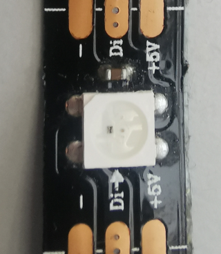

# wled
**ws2812b interface acting as an expansion port**

simple ws2812b led driver / same as the wled plugin but integrated as an expansion to combinate with other plugins

Keywords: expansion led rgb status info




## Basic-Example:
```
{
    "type": "wled",
    "pins": {
        "data": {
            "pin": "0"
        }
    }
}
```

## Pins:
*FPGA-pins*
### data:

 * direction: output


## Options:
*user-options*
### leds:
number of LED's

 * type: int
 * min: 0
 * max: 100
 * default: 1

### level:
LED brighness

 * type: int
 * min: 0
 * max: 255
 * default: 127

### name:
name of this plugin instance

 * type: str
 * default: 


## Signals:
*signals/pins in LinuxCNC*


## Interfaces:
*transport layer*


## Full-Example:
```
{
    "type": "wled",
    "leds": 1,
    "level": 127,
    "name": "",
    "pins": {
        "data": {
            "pin": "0",
            "modifiers": [
                {
                    "type": "invert"
                }
            ]
        }
    },
    "signals": {}
}
```

## Verilogs:
 * [ws2812.v](ws2812.v)
 * [wled.v](wled.v)
