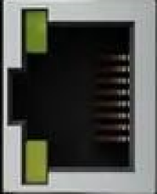

# Mix1

Small and low cost FPGA educational and development board

* Board: [ICEBreakerV1.0e](https://github.com/multigcs/riocore/blob/main/riocore/boards/ICEBreakerV1.0e/README.md)
* Config-Path: tests/unit/data/full/Mix1.json
* Output-Path: tests/unit/output/Mix1
* Toolchain: icestorm
* Protocol: UDP

## Axis/Joints
| Axis | Joint | Plugin | Home-Seq. |
| --- | --- | --- | --- |
| X | 0 | mesastepgen0 ([mesastepgen](https://github.com/multigcs/riocore/blob/main/riocore/plugins/mesastepgen/README.md)) | 0 | 
| Y | 1 | mesastepgen1 ([mesastepgen](https://github.com/multigcs/riocore/blob/main/riocore/plugins/mesastepgen/README.md)) | 0 | 
| Z | 2 | mesastepgen2 ([mesastepgen](https://github.com/multigcs/riocore/blob/main/riocore/plugins/mesastepgen/README.md)) | 0 | 
| A | 3 | stepdir0 ([stepdir](https://github.com/multigcs/riocore/blob/main/riocore/plugins/stepdir/README.md)) | 0 | 
| C | 4 | stepdir1 ([stepdir](https://github.com/multigcs/riocore/blob/main/riocore/plugins/stepdir/README.md)) | 0 | 
| B | 5 | ethercat1 ([ethercat](https://github.com/multigcs/riocore/blob/main/riocore/plugins/ethercat/README.md)) | 0 | 

## Plugins
| Type | Info | Instance | Image |
| --- | --- | --- | --- |
| [mesacard](https://github.com/multigcs/riocore/blob/main/riocore/plugins/mesacard/README.md) | mesacard | mesacard0 |  |
| [mesastepgen](https://github.com/multigcs/riocore/blob/main/riocore/plugins/mesastepgen/README.md) | masa step pulse generation | mesastepgen0, mesastepgen1, mesastepgen2 |  |
| [gpioin](https://github.com/multigcs/riocore/blob/main/riocore/plugins/gpioin/README.md) | gpio input | gpioin0, gpioin1, gpioin2 |  |
| [gpioout](https://github.com/multigcs/riocore/blob/main/riocore/plugins/gpioout/README.md) | gpio output | gpioout0 |  |
| [mesapwmgen](https://github.com/multigcs/riocore/blob/main/riocore/plugins/mesapwmgen/README.md) | mesa pwm pulse generation | mesapwmgen0 |  |
| [w5500](https://github.com/multigcs/riocore/blob/main/riocore/plugins/w5500/README.md) | udp interface for host comunication | w55000 |  |
| [stepdir](https://github.com/multigcs/riocore/blob/main/riocore/plugins/stepdir/README.md) | step/dir output for stepper drivers | stepdir0, stepdir1 |  |
| [blink](https://github.com/multigcs/riocore/blob/main/riocore/plugins/blink/README.md) | blinking output pin | blink0 |  |
| [ethercat](https://github.com/multigcs/riocore/blob/main/riocore/plugins/ethercat/README.md) | experimental ethercat driver | ethercat0, ethercat1 |  |
| [halinput](https://github.com/multigcs/riocore/blob/main/riocore/plugins/halinput/README.md) | joypad support | halinput0 |  |
| [bitout](https://github.com/multigcs/riocore/blob/main/riocore/plugins/bitout/README.md) | singe bit output pin | bitout0 |  |
| [bitin](https://github.com/multigcs/riocore/blob/main/riocore/plugins/bitin/README.md) | single input pin | bitin0 |  |
